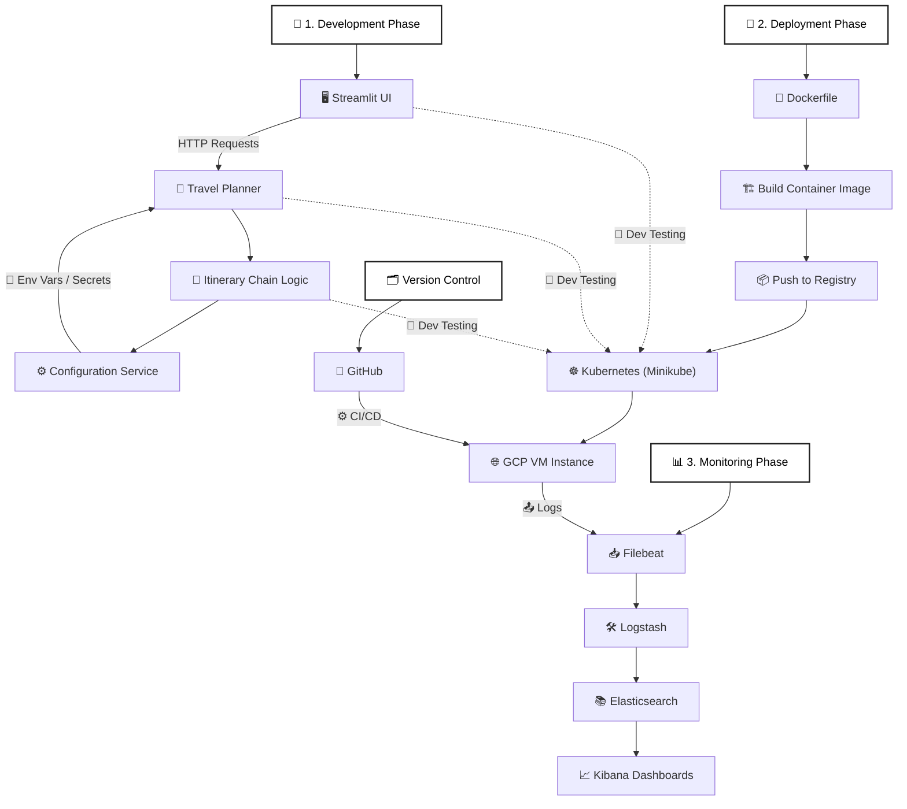

<p align="center">
  
  
  
  
  
  
  
</p>

# 🌍 TripWise: Your Smart Travel Companion

**TripWise** is an intelligent AI-powered travel itinerary planner built using **LLaMA-3.3-70B**, **Streamlit**, and **LangChain**. It leverages user inputs like destination, travel dates, and interests to generate personalized itineraries in real-time.

---

## 📌 Features

- 🧠 LLM-powered travel planning with LLaMA-3.3-70B
- 🗺️ Personalized itineraries based on user input
- ⚡ Fast generation via Groq API
- 🎯 Minimal and responsive UI with Streamlit
- 🚀 Fully containerized with Docker & deployed on GCP VM via Kubernetes (Minikube)
- 📈 Real-time monitoring using Filebeat, Logstash, Elasticsearch & Kibana

---

## 🔁 Project Architecture & Workflow


---
## 🧠 Tech Stack

| Layer              | Tools Used                                                   |
|-------------------|---------------------------------------------------------------|
| LLM Backend        | [LLaMA 3.3 70B - Versatile (via Groq API)]                   |
| App Framework      | Streamlit                                                    |
| LangChain Modules  | `langchain`, `langchain_community`, `langchain_groq`         |
| Deployment         | Docker, Kubernetes (Minikube), GCP VM                        |
| Monitoring         | Filebeat, Logstash, Elasticsearch, Kibana                    |

---
## 🧱 Project Structure
```bash
TripWise/
│
├── app.py                      # Streamlit main app
├── requirements.txt            # Python dependencies
├── setup.py                    # Package setup
├── .env                        # Environment variables
├── Dockerfile                  # Docker image definition
├── k8s-deployment.yaml         # Kubernetes deployment
│
├── src/
│   ├── core/
│   │   └── planner.py            # TravelPlanner logic using LLM
│   ├── chains/
│   │   └── itinerary_chain.py    # Itinerary chain logic & prompt construction
│   ├── config/
│   │   └── config.py             # Load API keys and .env settings
│   ├── utils/
│   │   ├── logger.py             # Logging with daily log rotation
│   │   └── custom_exception.py   # Exception handling with traceback info
│
├── filebeat.yaml              # Filebeat config for log shipping
├── logstash.yaml              # Logstash pipeline config
├── elasticsearch.yaml         # Elasticsearch deployment
├── kibana.yaml                # Kibana UI setup
│
└── logs/
    └── log_<date>.log         # Auto-generated log files
```
---
## ⚙️ Setup Instructions
### ✅ Prerequisites
Make sure you have the following installed and configured before starting:
- 🐍 Python 3.10+
- 🐳 Docker
- ☸️ Minikube (for Kubernetes deployment)
- ☁️ GCP VM Instance (for cloud hosting)
- 🔑 Groq API Key (LLaMA 3.3 70B model)
--- 
## 🚀 How to Run Locally
Follow these steps to set up and run **NexPick** locally:

### 1. Clone the Repository

```bash
git clone https://github.com/aimldinesh/TripWise.git
cd TripWise
```
### 2. Create and Activate Virtual Environment
```bash
python -m venv venv
source venv/bin/activate  # On Windows: venv\Scripts\activate
```
### 3. Install Dependencies
```bash
pip install -e .
```
### 4. Set Environment Variables
Create a .env file in the root directory and add your secrets like:
```bash
GROQ_API_KEY = " " 
```
### 5. Run the App
```bash
streamlit run app.py
```
The app will be available at:
---

## ✅ Docker Run (Optional)
```bash
# Build Docker image
docker build -t tripwise-app .

# Run the container
docker run -p 8501:8501 tripwise-app
```
---
## ☸️ Complete Deployment Setup

---
## 📊 Monitoring Setup (ELK Stack)
- Filebeat → Collects logs from app container
- Logstash → Filters & transforms logs
- Elasticsearch → Stores log data
- Kibana → Visualizes logs in dashboard
All components are deployed using Kubernetes under the logging namespace.

---
## 📸 Sample Output
---
## 🛠️ Future Improvements

